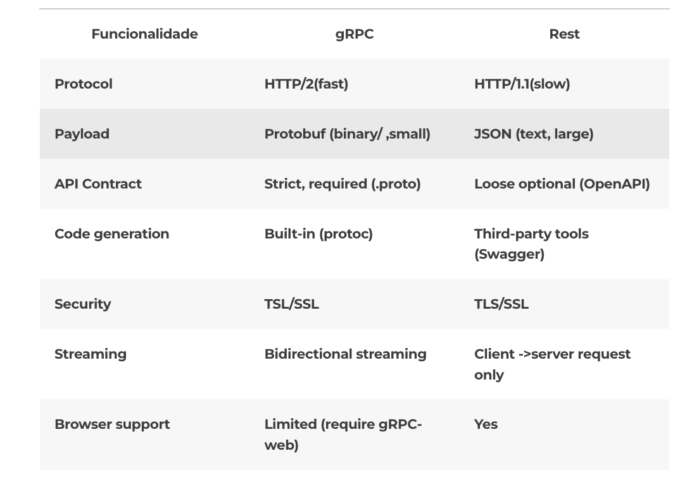

# Introdução ao uso do GRPC com Node.js

| Aluno | Matrícula |
| ----- | --------- |
| João Pedro Silva de Carvalho | 180033743 |
| Victor Samuel dos Santos Lucas | 180028685 |

## Objetivo

Experimentar o uso do Framework [GRPC](hOps://grpc.io) junto ao [ProfoBuf](hOps://developers.google.com/protocol-buffers/docs/overview), como interface de mensageria entre nós de uma aplicação distribuída. além disso fazer um comparativo com o RPC e com a comunicação por sockets que foram implementadas no laboraório anterior.

### gRPC


Nesse contexto, um ponto de grande impacto é o ganho de performance ao trafegar um payload extensivo, visto que, no gRPC a comunicação é feita em binário, o que traz uma melhora enorme na performance, que pode ser até 7 vezes mais rápida na resposta de dados e 10 vezes no envio. Isso se deve principalmente ao empacotamento compacto dos proto buffers e ao uso de HTTP/2 pelo gRPC.

A proposta do gRPC é que o cliente interaja com o servidor por meio de chamadas de funções simples, ou seja, de interfaces de códigos geradas automaticamente pela própria aplicação do gRPC. Isso significa que você precisa apenas implementar sua lógica de programação, o que facilita muito a adoção desse recurso.

Com isso, você tem algumas vantagens na sua arquitetura de microsserviços, como, por exemplo:
* Fácil o contrato entre cliente e servidor;
* Melhor o desempenho dos serviços;
* Features nativas do HTTP/2, como streaming de dados, load balance, monitoramento etc.

Em resumo, é como se você declarasse funções e classes em um back-end e pudesse acessá-los no front-end graças ao arquivo de contrato que contém suas interfaces (serviços e DTOs). 

Fonte [Zup](https://www.zup.com.br/blog/grpc-o-que-e-beagle).

#### GRPC x API REST

O que mais diverge do REST – o protocolo de comunicação mais comum em arquitetura de microsserviços – é que, com gRPC, são usados caminhos estáticos para um melhor desempenho durante o despacho de chamadas, já que a análise de path params, query params e payload adiciona latência e complexidade à comunicação entre serviços. 

Além disso, existe um conjunto de erros que são mais diretamente aplicáveis ​​a casos de uso de API do que os códigos de status HTTP convencionalmente utilizados no REST.

### Protocolo Http/2
HTTP2 é uma versão nova do protocolo HTTP/1.1 que é usado pela internet amplamente para servidores e sites. Ele permite a conversa padronizada entre cliente, em geral os navegadores, e servidor, que é onde fica armazenado o conteúdo enviado quando um site é acessado.

HTTP2 apesar de manter muitas das interfaces antigas do protocolo, conseguiu inovar bastante em relação a HTTP/1.1 permitindo que aplicações utilizem métodos como multiplexing em TCP para realizar diversas requisições. O novo protocolo também aproveita opções como a priorização de requisições e compressão de cabeçalho entre outras opções.

<div style="display: flex; justify-content: center; text-align: center">

</div>
<div style="display: flex; justify-content: center; text-align: center">
<p>Fonte: <a href="https://www.zup.com.br/blog/grpc-o-que-e-beagle">ZUP</a></p>
</div>

### ProtoBuf 


## Solução Apresentada
### Dependencias

* [GRPC](hOps://grpc.io)
* [ProfoBuf](hOps://developers.google.com/protocol-buffers/docs/overview)


### Como Rodar

#### Instalar Dependências

```
npm install
```

#### Servidor

``` shell
node index.js
```

#### Cliente

``` shell
cd client && node get_values.js
```

#### Docker-compose

É possível rodar o componente em apenas um terminal via Docker Compose

```shell
docker-compose build
docker-compose up
```

## Referências

[Site oficial do gRPC](https://grpc.io/)
[O guia completo do gRPC parte 1: O que é gRPC?](https://blog.lsantos.dev/guia-grpc-1/)
